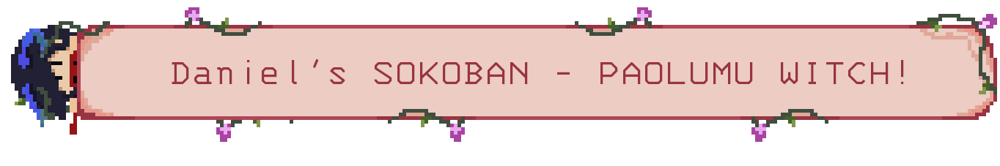
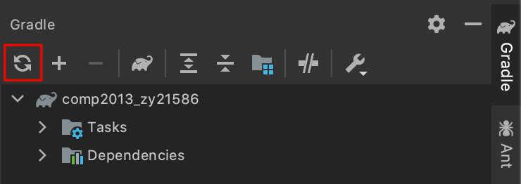
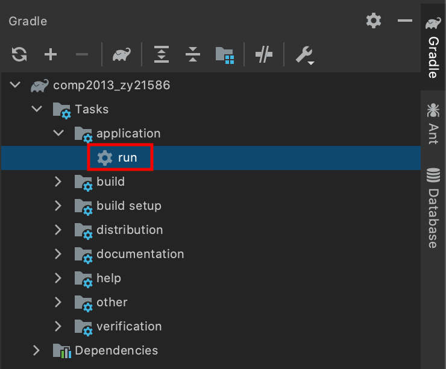
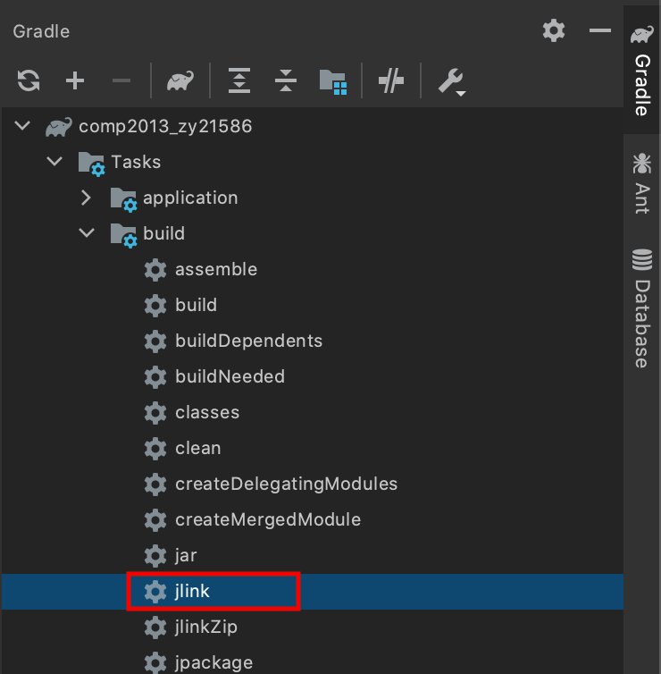
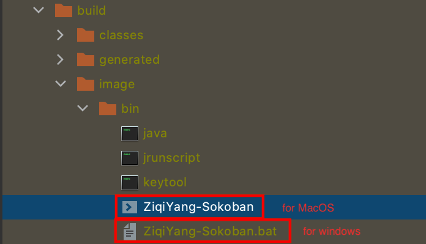

# COMP2013-Developing Maintainable Software Coursework

| Name               | Student Number | Username |
| ------------------ | -------------- | -------- |
| Ziqi Yang (Daniel) | 16521586       | zy21586  |

---

About The Game:

This game called "Paolumu witch", which is inspired by a cute monster "paolumu" from an action game named "Monster Hunter: World".  The witch character is a personification of this monster. The game follows the basic rules of classic game Sokoban with some additional rules implemented. The aim of the game is that the witch has make all rune stones (crates) absorb the power from magic clefts on each level. When the rune stone is pushed on the cleft, it will be sealed by the magic, therefore it can be no longer moved, and a flower on the old stone will bloom as the transformation of the magic absorbed. 

Notes:

1.  All sprites and animations of the game are self-designed by Aseprite and Adobe Photoshop.
2. All background images are self-designed by Adobe Photoshop from raw resources online.
3. All music and sound effects are found by bought version with licenses.

---

  
<h2> 1. Project Structure & Settings</h2>

| IDE                  | Java   | Gradle | Jlink                    |
| -------------------- | ------ | ------ | ------------------------ |
| IntelliJ IDEA 2020.3 | jdk-15 | 6.7    | org.beryx.jlink (2.22.3) |

  
<h2>2. How to compile the code to produce the application</h2>

  
<h4>Option one: running the project on IDE.</h4>

1. Unzip the src file 'YangZiqi_IntelliJ_JDK15.zip' and import it as Gradle project on IntelliJ IDEA.

2. Find the 'Gradle' Toolbar on the right sidebar of the IDE.

3. Reload the Gradle project by clicking the reload icon.

   

4. After reloading, find the task 'Tasks/application/run' and double click it to run the program.

   

5. Now, you can wait and play the game.

  
<h4> Option two: running the project as build.</h4>

1. Unzip the src file 'YangZiqi_IntelliJ_JDK15.zip' and import it as Gradle project on IntelliJ IDEA.

2. Find the 'Gradle' Toolbar on the right sidebar of the IDE.

3. Reload the Gradle project by clicking the reload icon.

   

4. After reloading, find the task 'Tasks/build/jlink' and double click it to build the program.

   

5. After building, you will get a build folder under the project folder.

6. To run the game, find the folder 'build/image/bin': if you are using MacOS, double click the 'ZiqiYang-Sokoban' file to execute the program; if you are using windows, double click the 'ZiqiYang-Sokoban.bat' file to execute the program.

   
   

   

  
<h2> 3. Javadoc</h2>

The Javadoc files can be found in the 'javadoc' folder.

  
<h2> 4. Maintenance & Refactoring </h2>

| Number | Description                                                  | Type        |
| ------ | ------------------------------------------------------------ | ----------- |
| 1      | All class variables start with sequence "`m_`" and use getters and setters for coding convention | Maintenance |
| 2      | `Utils` Class for reusable fields(constant) and methods      | Refactoring |
| 3      | `Debugger` class as convenient in-line debugging tool by using Trace and Test Flags | Maintenance |
| 4      | 'MVC' structure (model, view, control)                       | Refactoring |
| 5      | `GameEngine` package for hierarchical design                 | Refactoring |
| 6      | 'Singleton' design pattern on `GameEngine` class             | Refactoring |
| 7      | 'Observer' design pattern on `MusicManager` class            | Refactoring |
| 8      | 'Factory' design pattern on `GameObjectFactory` class        | Refactoring |
| 9      | 'Adapter' design pattern on viewPlayer package (`viewPlayer` interface, `ScreenPlayer` class and `ViewAdapter` class, working on static screen and different types of pop-up screen) | Refactoring |
| 10     | 'Manager' system design for background server and resource management (`GameManager` superclass and all its children: `DataManager`, `EventManager`, `LevelManager`, `MusicManager` and `ResourceManager`) | Refactoring |
| 11     | Message system by refactored `Logger` class for each game manager | Refactoring |
| 12     | Model system design (`GameObject` and all its children) facilitating conciser rendering and new features | Refactoring |
| 13     | 'Subscriber' design pattern on `PlayerController` class and `EventManager` class | Refactoring |
| 14     | View(game screen class and 'fxml' file) and Controller(screen controller class) system to render different screens. | Refactoring |
| 15     | Multi-layered graphic rendering system of game level to make better visual effect. | Refactoring |

  
<h2> 5. Features (working properly)</h2>

  
Screens

| Features                  | Description                                                  |
| ------------------------- | ------------------------------------------------------------ |
| Start Screen              | For user to start a new game/choose a set of level to play/check score board/quit. |
| Set Choosing Screen       | For user to choose a new set to play.                        |
| Gaming Screen             | The screen where user plays the game.                        |
| Score Board Screen        | For user to check highest score records(time consume and move count) of all levels. |
| Victory Screen            | The screen shown when the user completes a whole set of levels. |
| Score Board Pop Up Screen | The screen pops up when the user completes each level.       |
| Quit Game Pop Up Screen   | The screen pops up when the user intends to quit the game for double checking. |
| Alert Pop Up Screen       | The screen pops up when the user makes invalid input.        |

  
Game Rules

| Features      | Description                                                  |
| ------------- | ------------------------------------------------------------ |
| Sealed Crate  | When the crate hits a diamond (magic cleft), it cannot be moved by player anymore. Instead, it will absorb the magic and the flower on the crate will bloom. |
| Witch can fly | Press space to fly mode. When flying,  1. Player can fly over any object;  2. Each move will consume 2 steps.  3. Player can land on neither crate nor wall. |

  
Sprites & Animations

| Features              | Description                                                  | Where                              |
| --------------------- | ------------------------------------------------------------ | ---------------------------------- |
| 2.5D Wall Sprite      | 1. Plan wall sprite;  2. Orthotic perspective wall sprite | Gaming Screen                      |
| Witch (Player)        | 1. 4-direction idle sprites; 2. 4-direction pushing sprites;  3. 4-direction flying sprites;  4. Flying-off animation;  5. Landing animation; | Gaming Screen                      |
| Crate                 | 1. Normal crate sprite; 2. Sealed crate sprite(after hitting a diamond); 3. Blooming crate animation(when first time hitting a diamond); | Gaming Screen, Set Choosing Screen |
| Diamond (Magic cleft) | Magic cleft sprite.                                          | Gaming Screen                      |
| Buttons               | Button hovering and clicking animations.                     | All screens                        |
| Screen Layouts        | Background images, bar, board, and panel images.             | All screens                        |

  
Music & Sound Effects

| Features                  | Description                                                  |
| ------------------------- | ------------------------------------------------------------ |
| Background Music          | Start Screen Background Music.                               |
| Gaming Music              | Background Music when playing the game.                      |
| Level Completion Music    | Music when completing a level.                               |
| Set Completion Music      | Music when completing a set of levels.                       |
| Score Board Music         | Score Board Screen Background Music.                         |
| Set Choosing Music        | Set Choosing Screen Background Music.                        |
| Button Over Sound Effect  | Sound Effect when mouse hovering.                            |
| Button Click Sound Effect | Sound Effect when mouse clicking.                            |
| Blooming Sound Effect     | Sound Effect when a crate blooming. (hitting a diamond)      |
| Cannot Land Sound Effect  | Sound Effect when a player intends to land on crate or wall. |
| Pushing Sound Effect      | Sound Effect when a player is pushing a crate.               |
| Flying Off Sound Effect   | Sound Effect when a player just pressed the space to flying mode. |
| Landing Sound Effect      | Sound Effect when a player lands on ground successfully.     |

  
Important Buttons

| Features          | Description                     |
| ----------------- | ------------------------------- |
| Restart Button    | Restart the current game level. |
| Next Level Button | Move to next level.             |
| Back Home Button  | Back to start screen.           |

  
Others

| Features                    | Description                                                  | Where                     |
| --------------------------- | ------------------------------------------------------------ | ------------------------- |
| Wall colours & BG images    | Wall colour and background images are accordingly changed as themes when choosing different set to play. | Set Choosing Screen       |
| Animated Instruction        | Animated Instruction of how to play the game.                | Gaming Screen             |
| Score Record Name collector | If the player breaks a record, player's name is requested and recorded. | Score Board Pop Up Screen |
| Name Format Detector        | Name inputs are only valid when is within 1-16 word-characters; Otherwise, an alert window will pop up. | Score Board Pop Up Screen |
| Fonts                       | Different types of text will be set as different pixel font types. | All Screens               |

  
<h2> 6.Java classes</h2>

| New Introduced                                               | Modified                                                |
| ------------------------------------------------------------ | ------------------------------------------------------- |
| `org/ziqi/control/screenController/GamingScreenController.java` | `org/ziqi/control/PlayerController.java (Controller)`   |
| `org/ziqi/control/screenController/LevelSetScreenController.java` | `org/ziqi/model/Layer.java (GameGrid)`                  |
| `org/ziqi/control/screenController/ScoreBoardPopUpController.java` | `org/ziqi/gameEngine/Logger.java (GameLogger)`          |
| `org/ziqi/control/screenController/ScoreBoardScreenController.java` | `org/ziqi/gameEngine/base/GameObject.java (GameObject)` |
| `org/ziqi/control/screenController/StartScreenController.java` | `org/ziqi/model/Level.java (Level)`                     |
| `org/ziqi/control/screenController/VictoryScreenController.java` | `org/ziqi/Main.java (Main)`                             |
| `org/ziqi/gameEngine/base/GameScreen.java`                   | `org/ziqi/gameEngine/GameEngine.java (StartMeUp)`       |
| `org/ziqi/gameEngine/base/PopUpScreen.java`                  |                                                         |
| `org/ziqi/gameEngine/manager/GameManager.java`               |                                                         |
| `org/ziqi/gameEngine/manager/DataManager.java`               |                                                         |
| `org/ziqi/gameEngine/manager/EventManager.java`              |                                                         |
| `org/ziqi/gameEngine/manager/LevelManager.java`              |                                                         |
| `org/ziqi/gameEngine/manager/MusicManager.java`              |                                                         |
| `org/ziqi/gameEngine/manager/ResourceManager.java`           |                                                         |
| `org/ziqi/gameEngine/viewPlayer/ViewPlayer.java`             |                                                         |
| `org/ziqi/gameEngine/viewPlayer/ScreenPlayer.java`           |                                                         |
| `org/ziqi/gameEngine/viewPlayer/ViewAdapter.java`            |                                                         |
| `org/ziqi/gameEngine/GameObjectFactory.java`                 |                                                         |
| `org/ziqi/gameEngine/GraphicUnitRenderer.java`               |                                                         |
| `org/ziqi/model/Crate.java`                                  |                                                         |
| `org/ziqi/model/Diamond.java`                                |                                                         |
| `org/ziqi/model/Floor.java`                                  |                                                         |
| `org/ziqi/model/Layer.java`                                  |                                                         |
| `org/ziqi/model/Level.java`                                  |                                                         |
| `org/ziqi/model/Player.java`                                 |                                                         |
| `org/ziqi/model/Wall.java`                                   |                                                         |
| `org/ziqi/model/ScoreRecord.java`                            |                                                         |
| `org/ziqi/view/popUp/AlertPopUp.java`                        |                                                         |
| `org/ziqi/view/popUp/QuitGamePopUp.java`                     |                                                         |
| `org/ziqi/view/popUp/ScoreBoardPopUp.java`                   |                                                         |
| `org/ziqi/view/screen/GamingScreen.java`                     |                                                         |
| `org/ziqi/view/screen/LevelSetScreen.java`                   |                                                         |
| `org/ziqi/view/screen/ScoreBoardScreen.java`                 |                                                         |
| `org/ziqi/view/screen/StartScreen.java`                      |                                                         |
| `org/ziqi/view/screen/VictoryScreen.java`                    |                                                         |
| `org/ziqi/Debugger.java`                                     |                                                         |
| `org/ziqi/Utils.java`                                        |                                                         |

